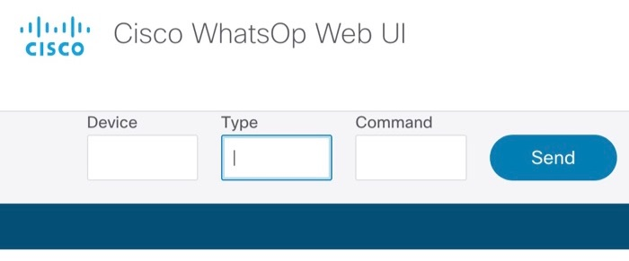
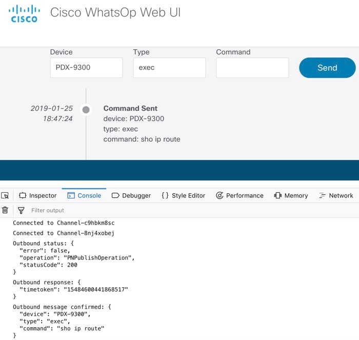
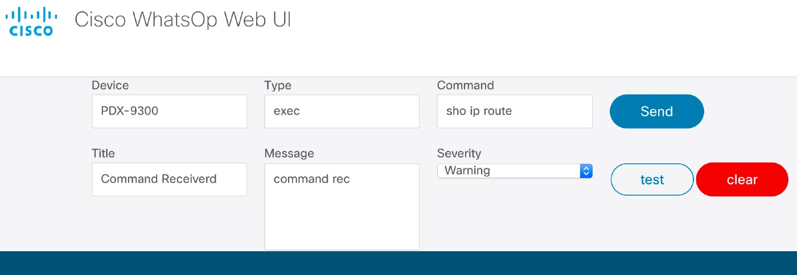
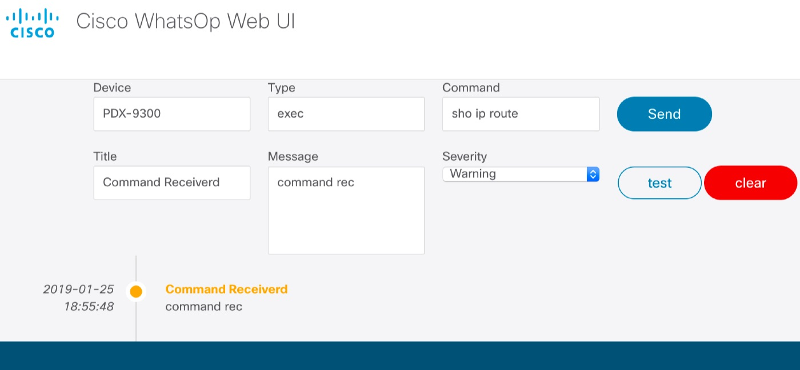

# WhatsOp Web UI
WhatsOp is a sample application that demonstrates the programmability of Cisco networking products.  This repo contains a Web UI that can be used as part of a WhatsOp demonstration.

The basic WhatsOp demo flow involves a client issuing commands to and receiving notifications from a network device via its [Guest Shell](https://www.cisco.com/c/en/us/td/docs/ios-xml/ios/prog/configuration/166/b_166_programmability_cg/guest_shell.html).  Other clients include a ServiceNow interface that communicates with the Guest Shell via [PubNub](https://www.pubnub.com/) channels.

## Overview
The WhatsOp Web UI interacts with the Guest Shell of a target device via two PubNub channels, the `Outbound` and the `Inbound`.  As the names suggest, the `Outbound` channel is for the Web UI to send commands to the device and the `Inbound` channel is for the device to send the results of those commands back to the Web UI.

To ease testing of the Web UI, it gets configured to both publish and subscribe to/from both channels.  All interaction between the channels gets output in the console log but the Web UI itgself only shows commands sent from the Web UI to the device and the responses from the device.  The Web UI contains a special testing mode so that it can be experimented with in absence of a device.

## Configuration
Before the Web UI can be used, it must be configured to communicate with the appropriate PubNub channels and optionally put in test mode.  The Web UI uses some in browser javascript trick to accomplish this.  In the `index.html` note that there are some global variable declarations:
```
var outChannelName = '';
var outPubKey = '';
var outSubKey = '';
var inChannelName = '';
var inPubKey = '';
var inSubKey = '';
var testMode = false;
```
followed by the inclusion of a `globals.js` file that does not appear in this repo, followed by the inclustion of the `pubnub.js` file that contains the core javascript logic for the Web UI.

To configure the Web UI, create a `globals.js` file and set the appropriate values:

```
outChannelName = '<insert outbound channel name'>;
outPubKey = '<insert outbound channel pub key>';
outSubKey = '<insert outbound channel sub key';
inChannelName = '<insert inbound channel name>';
inPubKey = '<insert inbound pub key>';
inSubKey = '<insert inbound sub key>';
testMode = <true|false>;
```

Because the variables are declared in the `index.html` file, setting them in the `global.js` file will carry the new values through to the `pubnub.js` file because of the order of insertion.

## Basic Operation
With `testMode = false`, the Web UI will look like this:



Enter the device name, type, command, and press `Send`.  This causes a message to be placed on the `Outbound` channel in the following format:

```
{
  "command":''",
  "type":"",
  "device":""
}
```
It will also cause the command to appear in `Secondary` severity on the UI (more on that in a moment) and validate that the message posted to the channel correctly by printing the subscription of the message to the console log:



It will clear the `Command` field upon completion but leave the `Device` and `Type` fields as is.

The Web UI then expects messages to be sent back to it on the `Inbound` channel from the device in the following format:

```
{
  "title":'"",
  "message":"",
  "severity":""
}
```
where `severity` should be one of:

* primary
* secondary
* success
* danger
* warning

## Test Operation
In absence of a devie, the Web UI contains a test mode that can be activated by setting `testMode = true`.  In addition to the functionality described above, this mode enables an additional set of inputs:



These can be used to publish faux information to the `Inbound` channel so that the resulting reaction of subscribed messages can be observed.  For example:


